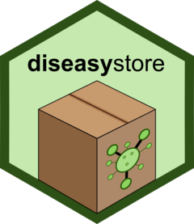

diseasystore
<a href="https://ssi-dk.github.io/diseasystore/"></a>
================

<!-- README.md is generated from README.Rmd. Please edit that file. -->
<!-- badges: start -->

[](https://CRAN.R-project.org/package=diseasystore)
[](https://github.com/ssi-dk/diseasystore/actions/workflows/all-workflows.yaml)
[](https://app.codecov.io/gh/ssi-dk/diseasystore)

<!-- badges: end -->

## Overview

The `diseasystore` package provides feature stores implemented in R
specifically designed for serve disease data for epidemic preparedness.

What makes a `diseasystore` special, is that features are time-versioned
via `{SCDB}` and can be automatically coupled and stratified within the
`diseasystore` package. This allows for a high degree of flexibility and
reproducibility in the handling of disease data.

The package forms the data-backbone of the `{diseasy}` package.

## Handling of diverse data sources

Different data sources are handled by individual `diseasystores` which
each facilitate access to the relevant disease data for the given data
source.

Data for different diseases will typically be structured in different
ways. The `diseasystore` package currently implements the Google Health
COVID-19 Open Repository with more `diseasystores` on the way.

The `diseasystore` package is designed to handle both individual-level
data (typically protected) and semi-aggregated data (typically publicly
available).

If the data is at the individual-level, the feature store is fully
dynamic and can adapt to (virtually) any stratification that the user
specifies. If the data conversely is semi-aggregated, the data can only
be stratified at the levels of the semi-aggregation (or at higher
levels).

## Installation

``` r
# Install diseasystore from CRAN:
install.packages("diseasystore")

# Alternatively, install the development version from github:
# install.packages("devtools")
devtools::install_github("ssi-dk/diseasystore")
```

## Usage

For basic usage examples, see `vignette("diseasystore")`.
